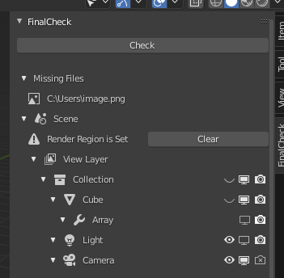

# FinalCheck - Blender Addon

日本語版は下にあります。/ Japanese version below.

## NO MORE Rendering Failures!

This addon detects problems in your project and make your render successful.

Download it for free from [Gumroad](https://omineme.gumroad.com/l/finalcheck) or [GitHub](https://github.com/omine-me/FinalCheck/releases). (Social tipping is available in Gumroad.)  
You can also get the same content from [Blender Market](https://blendermarket.com/products/finalcheck) for $1.

  
A list of problematic items appears.

## About

Do you ever have to re-render your scene because of a small mistake?
This addon detects various problems of your project and suggest corrections.
Check with a single button and fix problems at once.

### Environment

#### Compatible Blender Versions

- Blender 2.90 or later

### Languages

- English, Japanese

## Installation

#### Download

Download a .zip file from [Gumroad](https://omineme.gumroad.com/l/finalcheck), [GitHub](https://github.com/omine-me/FinalCheck/releases) or [Blender Market](https://blendermarket.com/products/finalcheck).

#### Installation

Install the addon from Edit -> Preferences... -> Add-ons -> Install...  
You don't have to extract zip file.

## Usage

1. Open Sidebar in 3D Viewport.
1. In FinalCheck Panel, hit Check button.
1. A list of problematic items appears.

In Preferences sub-panel, you can toggle which items will be checked. These preferences are saved automatically.

[**[New!]** Checking automatically when rendering is available.](./CHANGELOG.md)

### Check Items

- **Collections Visibility**: Compare visibility of collections in viewport and render.
- **Objects Visibility**: Compare visibility of objects in viewport and render.
- **Missing Files**: Check image path validity.
- **Render Region**: Check if Render Region is not set.
- **Resolution%**: Check if Resolution% is greater than or equal to 100%.
- **Samples**: Check if render samples are greater than or equal to preview samples.
- **Instancing**: Compare visibility of instancer in viewport and render.
- **Modifiers**: Compare visibility of modifiers in viewport and render.
- **Composite** (alpha version): Check if inputs of Viewer node and Composite node are the same.
  This is currently incomplete due to limitations of Blender Python API.
- **Particles**:
  - **Show Emitter**: Compare visibility of particle emitter in viewport and render.
  - **Child Amount**: Check if child amount of particles in viewport and render are the same.
  - **Viewport Display Amount**: Check if amount of particles in viewport is 100%.
- **Grease Pencil**:
  - **Modifiers**: Compare visibility of modifiers in viewport and render.
  - **Effects**: Compare visibility of effects in viewport and render.

You can also choose where to check: all scenes or current scene/view_layer only.

## FAQ

**Q**: **Render result is not what I intended**  
**A**: This addon does not detect all problems. Check is based on current frame and does not consider status of other frames.

**Q**: **Check takes a long time**  
**A**: Complex file may take longer to check. Try to decrease check items from preference. Checking image paths on network locations may also take time.

## Feedback

If you find bugs or have an improvement, let me know in issues or my [Twitter](https://twitter.com/mineBeReal).
Any improvement of English in UI is also appreciate as I'm not native to English.
Thanks for using FinalCheck.

Give me a [Star](https://github.com/omine-me/FinalCheck) if you like!

## License

Distributed under the MIT License.

---

## レンダリングの失敗をなくそう！

このアドオンは、Blender ファイルの問題を検出し、レンダリングを一発で成功させます。

[Gumroad](https://omineme.gumroad.com/l/finalcheck) もしくは [GitHub](https://github.com/omine-me/FinalCheck/releases)から無料でダウンロードできます。(Gumroad では投げ銭を受け付けています。)  
または、[Blender Market](https://blendermarket.com/products/finalcheck)から 1 ドルで購入できます(いずれも内容は同じです)。

  
問題がある思われる項目が一覧で表示されます。

## はじめに

ほんの小さなミスで時間のかかるレンダリングをやり直すこと、ありますよね。  
このアドオンを使えば、ファイルの問題を見つけ出し、簡単に修正できます。  
ボタン一つで制作を効率化しましょう。

### 環境

#### 利用可能な Blender のバージョン

- Blender 2.90 以降

### 言語

- 日本語, 英語

## インストール

#### ダウンロード

[Gumroad](https://omineme.gumroad.com/l/finalcheck)、[GitHub](https://github.com/omine-me/FinalCheck/releases)、[Blender Market](https://blendermarket.com/products/finalcheck)のいずれかから zip ファイルをダウンロードします。

#### インストール

編集 -> プリファレンス... -> アドオン -> インストール... からインストールします。
zip ファイルを展開する必要はありません。

## 使い方

1. 3D ビューポートでサイドパネルを開きます。
1. FinalCheck パネルからチェックボタンを押します。
1. 問題がある思われる項目が一覧で表示されます。

プリファレンスサブパネルから、チェックする項目を設定できます。これらは自動で保存されます。

[**[New!]** レンダリング時に自動でチェックできるようになりました。](./CHANGELOG.md)

### チェックする項目

- **コレクションの可視性**: ビューポートとレンダーでコレクションの可視性が同じか。
- **オブジェクトの可視性**: ビューポートとレンダーでオブジェクトの可視性が同じか。
- **パスが不明なファイル**: 画像ファイルのパスが有効か。
- **レンダー領域**: レンダー領域が設定されていて、レンダー領域が縮小しているか。
- **解像度%**: 解像度%が100%以上か。
- **サンプル数**: レンダーのサンプル数がビューポートのサンプル数以上か。
- **インスタンス化**: ビューポートとレンダーでインスタンサーの可視性が同じか。
- **モディファイア**: ビューポートとレンダーでモディファイアの可視性が同じか。
- **コンポジット** (アルファ版): ビューアーノードとコンポジットノードのインプットが同じか。コンポジットのチェックは、Blender Python API の制約により現状不完全です。
- **パーティクル**:
  - **エミッターを表示**: ビューポートとレンダーでエミッターの可視性が同じか。
  - **子パーティクルの量**: ビューポートとレンダーで子パーティクルの量が同じか。
  - **パーティクルの表示率**: ビューポートでのパーティクルの表示率が100%か。
- **グリースペンシル**:
  - **モディファイア**: ビューポートとレンダーでモディファイアの可視性が同じか。
  - **エフェクト**: ビューポートとレンダーでエフェクトの可視性が同じか。

プリファレンスから、全てのシーンをチェックするか、現在のシーン/ビューレイヤーのみをチェックするかも選択できます。

## FAQ

**Q**: **チェックしたにもかかわらず、意図しないレンダリングになる**  
**A**: 本アドオンは全てのミスを発見するものではありません。また、チェックは現在のフレームを元に行われ、他のフレームの状態をチェックしません。

**Q**: **チェックに時間がかかる**  
**A**: 複雑なファイルだとチェックに時間がかかることがあります。プリファレンスからチェック項目を減らしてみてください。また、パスが不明なファイルをチェックする際にネットワーク上のパスがあると、時間がかかることがあります。

## フィードバック

バグやご意見は、issues や[ツイッター](https://twitter.com/mineBeReal)からお願いします。
改善案も歓迎です。
[Star](https://github.com/omine-me/FinalCheck)をいただけると励みになります！

## ライセンス

MIT ライセンスの下で利用可能です。
